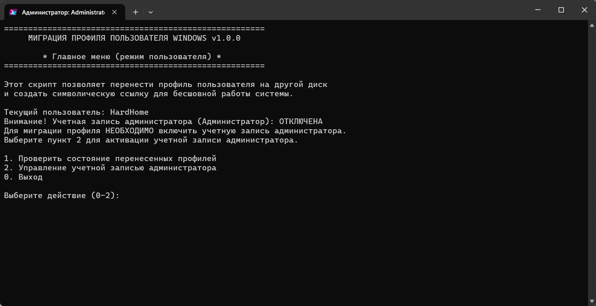
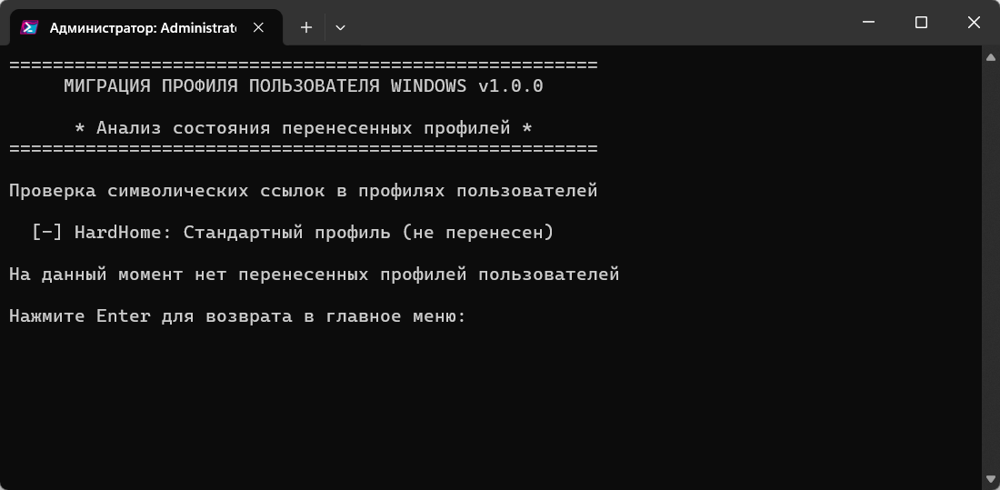

# WinUserMigrator - Перенос профилей пользователей Windows

**Версия:** 1.0.1

## Описание

WinUserMigrator переносит профили пользователей Windows с системного диска C: на другие диски и создает символические ссылки. Это освобождает место на системном диске без нарушения работы программ.

## Возможности

- Перенос профилей между дисками с созданием символических ссылок
- Управление учетными записями администратора и пользователей
- Русскоязычный интерфейс с пошаговыми инструкциями
- Логирование операций и восстановление при ошибках
- Проверка состояния перенесенных профилей

## Требования

- Windows 10/11
- PowerShell 5.1+
- Права администратора
- Дополнительный диск для переноса

## Как использовать

### Из обычной учетной записи

1. Запустите скрипт от имени администратора (через .bat или правой кнопкой → "Запустить с PowerShell")
2. Скрипт проверит учетную запись администратора и при необходимости предложит её включить
3. Войдите в систему под учетной записью администратора
4. Запустите скрипт снова

### Из учетной записи администратора

1. Выберите "Начать миграцию профиля пользователя"
2. Следуйте инструкциям:
   - Выберите профиль и целевой диск
   - Подтвердите параметры
   - После завершения перезагрузите компьютер

### Дополнительные функции

- "Управление учетными записями" - включение/отключение учетных записей
- "Проверить состояние" - просмотр перенесенных профилей и их статуса

### Обработка существующих профилей

При обнаружении профиля с таким же именем на целевом диске:
1. Переименовать целевой профиль
2. Переименовать исходный профиль
3. Заменить существующий профиль

## Безопасность

- Создание резервных копий профилей
- Восстановление при ошибках
- Подробное логирование в `Logs\MoveUserProfile_YYYY-MM-DD_HHMMSS.log`

## Ограничения

- Нельзя перемещать профиль активного пользователя
- Пользователь должен быть выключен во время миграции
- Нужно достаточно места на целевом диске

## Скриншоты

### Главное меню

### Проверка состояния

## Автор - CriDos

© 2025